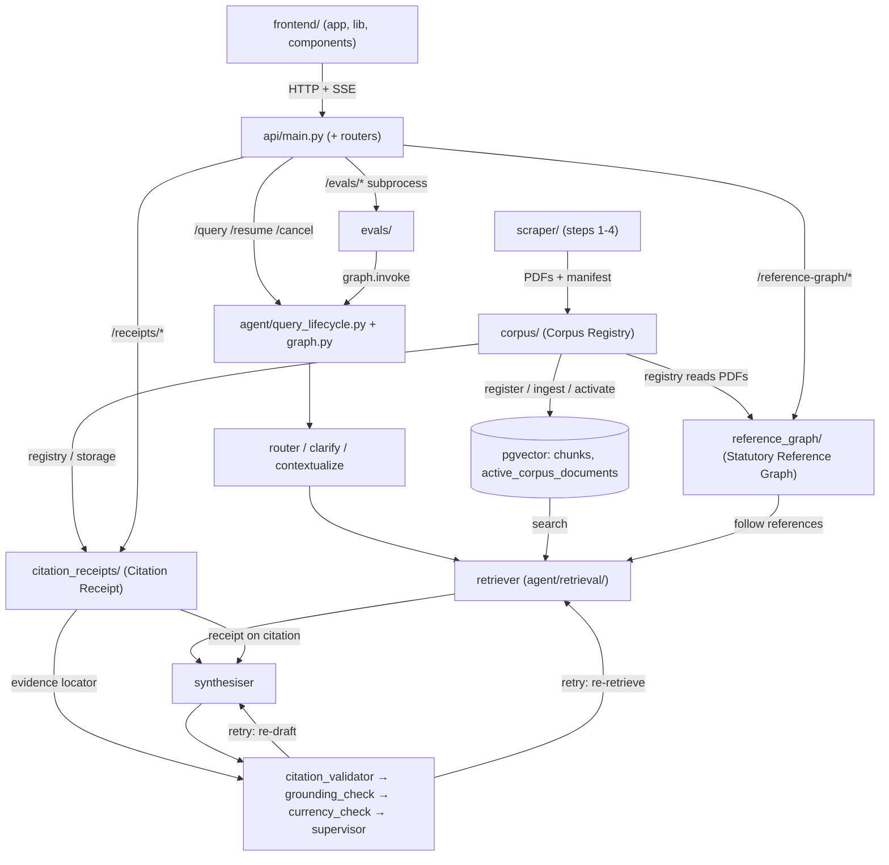

# Contributing

## Workflow

Do **not** commit directly to `main`. For every change — including small fixes and anything an AI agent makes on your behalf — create a new branch, push it, and open a pull request:

```bash
git switch -c <type>/<short-description>   # e.g. fix/citation-links-new-tab
# ...make changes, commit...
git push -u origin <branch>
gh pr create
```

Use a `<type>/` prefix that matches the change: `feat/`, `fix/`, `chore/`, `docs/`, `refactor/`. `main` stays deployable; every change lands through a reviewable PR.

## Architecture map

Use this to find which directory owns what. Each edge was checked against imports, routes, or `agent/graph.py` in [#185](https://github.com/aishahsofea/ai-legal-tool/issues/185), which lists the source file for every edge.



| Node | Path | Read when you change | What it does |
|---|---|---|---|
| SRC | `scraper/`, `run.py` | how Acts and PDFs are fetched | Scrapes lom.agc.gov.my and cuts section chunks (steps 1-4). |
| CORPUS | `corpus/` | Act identity, manifests, extraction runs, rollout | Owns the registry, extraction sidecars, and DB registration. |
| PG | `ingestion/step5_ingest.py`, `corpus/db.py`, `migrations/` | missing or stale chunks | Embeds and stores chunks. The `active_corpus_documents` table picks which extraction is live. |
| REFG | `reference_graph/` | cross-reference edges, snapshots, audits | Builds, checks, and serves promoted reference-graph files. |
| RCPT | `citation_receipts/` | citation provenance, passage location | Holds immutable receipt documents and finds Evidence Spans deterministically. |
| API | `api/main.py`, `api/*.py` | an endpoint or SSE event shape | HTTP entry points, SSE streaming, and the receipts, reference-graph, and evals routers. |
| FE | `frontend/lib/`, `frontend/app/workspace/` | the chat UI, receipt viewer, graph explorer | Calls the API. Shows chat, citations, and receipts. |
| LIFE | `agent/query_lifecycle.py`, `agent/graph.py` | graph wiring, cancel/resume, streaming | Runs the compiled LangGraph and turns it into stream events. |
| ROUTE | `agent/nodes/router.py`, `router_jev.py`, `clarify.py`, `contextualize.py` | query classification, clarification | `router.py` classifies the query. `router_jev.py` is the Jev first pass (see `ROUTER_JEV_ENABLED`). `clarify.py` asks the user a question. `contextualize.py` rewrites the query to stand alone. |
| RETR | `agent/nodes/retriever.py`, `agent/retrieval/` | search, tools, reference following | Fetches chunks by search. With `AGENTIC_RETRIEVAL` on, a ReAct agent runs the search instead. |
| SYNTH | `agent/nodes/synthesiser.py` | the answer prompt, citation building | Drafts the answer and attaches a receipt to each citation. |
| VERIFY | `agent/nodes/{citation_validator,grounding_check,currency_check,supervisor}.py` | validation, repeal labels, retry rules | `citation_validator` checks citations. `grounding_check` checks claims against sources. `currency_check` labels repealed or amended Acts. `supervisor` retries or finishes. |
| EVALS | `evals/`, `evals/dataset.json` | behaviour the evals measure | Runs datasets through the graph with assertions and a judge. |

Not on the map:

- **Graph branches:** `escalate`, `conversational`, `recall_conversational`, the `clarify` interrupt loop, `start_turn`, `record_turn`. See [README.md](README.md#how-it-works).
- **Semantic Memory:** `agent/memory/`, the `recall` node, the checkpointer and store.
- **Helper modules:** `agent/web_search.py`, `llm_factory.py`, `feature_flags.py`, `observability.py`, `citation_keys.py`, `query_policy.py`.
- **Scraper-to-agent file link:** `citation_validator` and `currency_check` read Act metadata through `scraper/act_paths`, not the DB.
- **Evals to retrieval:** `evals/assertions.py` imports `agent.retrieval.search`.
- **Eval seeding:** `evals/seed_test_corpus.py` writes to the eval database.
- **The SSE reply path** from LIFE back to API.
- **Infra and data:** Railway, Vercel, `data/`, `schemas/`, `.agent/standards`.

## Local Setup

### Prerequisites

- Python 3.11+
- Node.js 20+
- PostgreSQL 16 with the `vector` extension ([pgvector](https://github.com/pgvector/pgvector))

This repo carries the shared [ai-standards](https://github.com/aishahsofea/ai-standards) rules as a git submodule at `.agent/standards`. A plain `git clone` leaves it empty — clone recursively, or populate it after the fact:

```bash
git clone --recurse-submodules <repo-url>
# or, after a plain clone:
git submodule update --init --recursive
```

### 1. Python dependencies

```bash
pip3 install -r requirements.txt
```

### 2. Environment variables

Copy the template, then fill in its first three values: `DATABASE_URL`, `OPENAI_API_KEY`, and `ANTHROPIC_API_KEY`.

```bash
cp .env.example .env
```

All other lines are optional and commented out. Each group's comment names the section that explains it. To set a value, uncomment its line. Never leave a value blank: python-dotenv loads `NAME=` as an empty string, so the code gets `""` instead of its default. A blank `MAX_HISTORY_TOKENS=` stops the API from starting.

When the code starts reading a new variable, add it to `.env.example`. `tests/test_env_example.py` fails until you do. A variable that only an SDK reads also goes in that test's `_READ_BY_SDKS`.

With `LANGSMITH_TRACING=true`, every graph run traces to LangSmith. The query lifecycle also tags each run — `run_name=legal_query`, `source:api`/`source:eval`, active feature flags — attaches `user_id`/`thread_id` metadata, and posts the turn's quality signals as run **feedback** (`agent/observability.py`): `passed`, `num_violations`, `num_evidence_violations`, `retry_count`, `num_citations`, `fallback_delivered`, `escalated`, a categorical `query_type`. Feedback also includes numeric reference-follow counters — calls, skips/disabled/unavailable, edges considered/returned, target lookup outcomes, boundaries, fail-open occurrences — never provision text, evidence phrases, or query content. Fail-open, off the hot path: it never alters or delays a response. Each Jev call (`agent/jev_client.py`) also traces as a model run named `jev`, under the router or grounding span. It records the model, the input, the answers with probabilities, and token usage, never the API key. The input is the query and history for the router, and the answer and its cited sources for grounding. The Lightning router prompt and the Ultra judge prompt already put this text in the run traces, so Jev adds no new exposure. Leave `LANGSMITH_TRACING` unset to disable tracing and feedback entirely.

Optional flags are off by default. Set one to `1`, `true`, `yes`, or `on` to turn it on. Any other value leaves it off. `GROUNDING_JEV_ENABLED` and `ROUTER_JEV_ENABLED` are the exceptions. They are on by default, and `0`, `false`, `no`, or `off` disables them.

**Auth and CORS**

| Variable | Default | What it does |
|---|---|---|
| `SUPABASE_URL` | none, required | Project URL. The API fetches the signing keys from `<SUPABASE_URL>/auth/v1/.well-known/jwks.json`. |
| `SUPABASE_JWT_SECRET` | unset | Only for a project still signing with the legacy HS256 secret. Unset, an HS256 token is rejected. |
| `FRONTEND_ORIGIN` | `http://localhost:3000` | Comma-separated browser origins the API answers with CORS headers. A blank value means the default. Never `*`. Set it to the frontend URL on Railway. |

The frontend reads `NEXT_PUBLIC_SUPABASE_URL` and `NEXT_PUBLIC_SUPABASE_ANON_KEY` from `frontend/.env.local` (template: `frontend/.env.example`).

**Memory**

| Variable | Values | Default | What it does |
|---|---|---|---|
| `CHECKPOINTER` | `memory` | Postgres if `DATABASE_URL` set | Forces the in-process `MemorySaver` + `InMemoryStore`. For local runs without a database. Tests set it automatically. |
| `SEMANTIC_MEMORY_RECALL` | `on` | off | `recall` lets the synthesiser **read** cross-thread **Semantic Memory** (ADR 0010). Fail-open. |
| `SEMANTIC_MEMORY_EXTRACT` | `on` | off | Background **write** path (`agent/memory/extractor.py`). Saves durable practitioner facts, including professional background (ADR 0012), after the response is delivered. Fail-open. |
| `SEMANTIC_MEMORY_PRUNE` | `on` | off | Background **maintenance** path (`agent/memory/pruner.py`). Fail-open, off the hot path, size-debounced. |

Turn recall and extract on together to see earlier facts. The pruner consolidates duplicate profiles and near-duplicate topics. It evicts low-value topics by importance + recency, not TTL. It never deletes the sole profile or empties a namespace.

**Retrieval**

| Variable | Values | Default | What it does |
|---|---|---|---|
| `AGENTIC_RETRIEVAL` | `1` | off | Swaps the deterministic `retriever` node for a `create_agent` ReAct loop (ADR 0013). Fail-open: any error or empty result falls back to the deterministic pgvector path. |
| `RETRIEVAL_MAX_MODEL_CALLS` | integer | 8 | Bounds the ReAct loop. |
| `RETRIEVAL_RECURSION_LIMIT` | integer | `4 x RETRIEVAL_MAX_MODEL_CALLS + 2` (34) | Backstop, not the budget. |
| `CORPUS_RETRIEVAL_MODE` | `dual`, `verified`, `legacy` | `dual` | Which rows retrieval reads. `dual`: legacy rows plus provenance rows joined to the active Act/language mapping. `verified`: active provenance only. `legacy`: rollback path; reads only rows with no provenance, so no shadow-ingested row is visible, activated or not. |

`AGENTIC_RETRIEVAL` binds `search_statutes` / `lookup_section`. When on:

- An evidence violation makes the retry loop re-retrieve with feedback, not just re-draft.
- Retrieval tools stream `tool_call` SSE events into the PROCESS panel.
- The eval `tool_selection` assertion (`expected_tool`) only runs with it on.
- `RETRIEVAL_MAX_MODEL_CALLS` ends the loop on the budget's last call and returns the sections it has, instead of raising. Without that, a query not answered by the corpus can reformulate forever. Measured runs converge in 4-5 calls.
- Each model round costs four graph super-steps, hence `RETRIEVAL_RECURSION_LIMIT`'s default of 34. Set lower, it fires before the budget does. The run then keeps the sections already reached. Only an empty result falls back to the deterministic path.

**Receipts**

| Variable | Values | Default | What it does |
|---|---|---|---|
| `RECEIPT_DELIVERY_MODE` | `auto`, `local`, `redirect`, `proxy` | `auto` | Where receipt bytes come from; see bullets. An unrecognised value falls back to `auto`. |
| `RECEIPT_EVIDENCE_MAX_CHARS` | integer, 1-500 | 500 | Longest quote, in characters, kept as an **Evidence Span**. A longer quote is left off the receipt but does not fail the grounding check. Values outside 1-500 are clamped. A non-number logs a warning and uses 500. |

- `auto` prefers verified local bytes. With none present it falls back to CDN objects whose length, content type, and ETag (a content MD5) match the registry.
- `local` uses local bytes only and fails closed rather than reaching for the CDN.
- `redirect` and `proxy` skip local bytes and need `CORPUS_CDN_BASE_URL`.
- In every mode, remote coordinate sidecars are hash-checked again after download.

**Reference graph**

| Variable | Values | Default | What it does |
|---|---|---|---|
| `REFERENCE_GRAPH_ENABLED` | `on` | off | Exposes a **promoted**, independently validated statutory reference graph. Builds, promotes, and loads nothing; the `reference_graph.cli` commands below do that. |
| `REFERENCE_GRAPH_COMPARISON_ENABLED` | `on` | off | Adds snapshot selection and one-hop comparison. Needs `REFERENCE_GRAPH_ENABLED=on`. Fails closed without disabling Phase 1. |
| `FOLLOW_REFERENCES_ENABLED` | `on` | off | Adds `follow_references` to the **Retrieval Agent** only, so `AGENTIC_RETRIEVAL` must be on too. Does not need `REFERENCE_GRAPH_ENABLED`, which governs public UI/API exposure; retrieval reads promoted artifacts through `ReferenceGraphStore`. Off: model sees only `search_statutes` / `lookup_section`, original prompt. |
| `REFERENCE_GRAPH_ROOT` | path | `data/reference_graph` | Read-only root of promoted artifacts, read by the public graph flags and `follow_references`. Point it at an operator deployment's artifact root. |

**Commentary**

| Variable | Values | Default | What it does |
|---|---|---|---|
| `WEB_COMMENTARY_ENABLED` | `on` | off | Adds `search_commentary` to the **Retrieval Agent**, gated like `FOLLOW_REFERENCES_ENABLED`: needs `AGENTIC_RETRIEVAL` too (ADR 0020). |
| `COMMENTARY_ALLOWLIST` | comma-separated domains | empty | Publisher domains `search_commentary` may return, e.g. `skrine.com,shearndelamore.com,themalaysianlawyer.com` (the draft list from #56's Phase 0 allowlist call). Match is exact or subdomain, case-insensitive; anything else is dropped and counted, never returned. Empty or unset drops every result, even with the flag and `TAVILY_API_KEY` set. This is operator config, not a code default. |
| `TAVILY_API_KEY` | key | unset | Credential for `agent/web_search.py` (#119), the Tavily client `search_commentary` (#56) uses. |

`search_commentary` writes background material to the `commentary` state channel as **Commentary Notes**. The synthesiser may mention a note for background but never cites it by section or adds it to `citation_refs`, and the grounding check never judges an unattributed background sentence as a claim. The flag changes what the agent may say, never what it can cite. A turn's notes ride the SSE `response` event and `QueryResult` as `commentary`, present only when non-empty. The frontend renders them in their own `COMMENTARY` block (`frontend/components/locus-workspace/Messages.tsx`), separate from `SOURCE MAP` and `SOURCES USED`.

`agent/web_search.py` has no flag and no default allowlist. Each caller passes its own domains and flag. A result from any other host is dropped and counted. Every failure comes back as a reason in the result, never an exception: missing key, HTTP error, timeout, unparseable response, no hits.

**Grounding and currency**

| Variable | Values | Default | What it does |
|---|---|---|---|
| `CURRENCY_CHECK_ENABLED` | `on` | off | Adds `currency_check` between `grounding_check` and `supervisor`. Fails open: on error the turn gets no labels; the answer is never blocked. |
| `GROUNDING_JEV_ENABLED` | `off` | on | Set `off` to disable the cheap Jev pass before the grounding judge (#201). It also needs `TYPESAFE_API_KEY` and `JEV_MODEL` set. |
| `GROUNDING_JEV_THRESHOLD` | number, above 0 and at most 1 | 0.97 | Minimum P(supported) to skip the judge. Any other value uses 0.97, with a logged warning. |
| `ROUTER_JEV_ENABLED` | `off` | on | Set `off` to disable the router first pass through Jev (#212). It also needs `TYPESAFE_API_KEY` and `JEV_MODEL` set. On a Jev error or timeout (2s) the router falls back to the LLM router. |
| `TYPESAFE_API_KEY` | key | unset | Credential for the Jev API. |
| `JEV_MODEL` | model version | unset | Pinned Jev version, e.g. `jev-1.13.0`. Required for the grounding and router first passes. `jev-latest` is rejected because a floating model can shift scores under a fixed threshold. |

`currency_check` makes no network call and no model call. For each cited Act, it reads the Act's own metadata timeline (`data/acts_metadata/<act>.json`) and the corpus manifest (`data/pdfs/manifest.json`), attaching one of four Currency Labels to the citation. Labels ship on the SSE `response` event and `QueryResult` as `currency_labels` (only when non-empty) and render as a citation badge (`frontend/components/locus-workspace/Messages.tsx`). See [CONTEXT.md](CONTEXT.md#language), **Currency Label**, for the four outcomes, how each renders, and its limits. Run `python3 -m evals.currency_split` for a current split of the indexed corpus by outcome.

Jev (`agent/jev_client.py`) sees the same answer and cited sources as the judge, and scores the whole answer in one call. The judge is skipped only if that score is at or above `GROUNDING_JEV_THRESHOLD`. Any other result goes to the judge, including a Jev error. A skipped answer has no **Evidence Spans**, because Jev returns a score and no quote. On 25 answers over four Jev runs (#201), an answer the judge flagged scored as high as 0.95, and scores moved by up to 0.14 between runs.

The frontend has its own template:

```bash
cp frontend/.env.example frontend/.env.local
```

### 3. Database schema

The normal corpus rollout command applies the additive migration automatically, after local assets pass verification. The migration creates immutable document/source/extraction tables, active and historical mappings, and nullable provenance columns on legacy `chunks` — it never infers provenance for existing rows. `python3 -m corpus migrate` stays available for database-only maintenance.

`chunks.division` is one of those nullable columns — see [division](CONTEXT.md#language). It is `NULL` on rows ingested before the column existed; retrieval reads those as body sections. An exact section lookup returns body sections ahead of schedule paragraphs that carry the same number.

Saved threads use two tables, `threads` and `thread_turns`. `migrations/0002_threads.sql` creates them. Nothing applies it on startup, so run it once per database. Running it again is safe.

```bash
psql "$DATABASE_URL" -f migrations/0002_threads.sql
```

Until you run it, `/query` fails for every signed-in user, because `/query` writes a `threads` row before the graph runs.

### Sign-in (Supabase Auth)

The workspace is behind a GitHub sign-in (ADR 0022). One-time setup:

1. Create a GitHub OAuth app. Its callback URL is `https://<project-ref>.supabase.co/auth/v1/callback`.
2. In the Supabase dashboard, open Authentication, Providers, GitHub. Enable it and paste the app's client id and secret.
3. Under Authentication, URL Configuration, add `http://localhost:3000/auth/callback` and the deployed frontend's `/auth/callback` to the redirect URLs.
4. Set `SUPABASE_URL` in `.env`, and the two `NEXT_PUBLIC_SUPABASE_*` values in `frontend/.env.local`. The anon key is in the dashboard under Project Settings, API.
5. In Project Settings, JWT Keys, check how the project signs. Only a project on the legacy HS256 secret needs `SUPABASE_JWT_SECRET`.

Open sign-up lets anyone with a GitHub account spend the model budget. To limit it, turn off sign-ups under Authentication, Sign In / Providers. Then create the judge accounts by hand.

### 4. Build the knowledge base (one-time, ~1 hour)

```bash
python run.py --step all
python3 -m corpus rollout --dry-run
python3 -m corpus rollout
```

`corpus rollout` is the normal receipt setup and upgrade path — idempotent and resumable. Missing extraction assets get generated, the schema and registry get applied, only absent exact extractions are embedded and ingested, only successful verified runs get activated. A failure for one document is reported without activating it or blocking the rest. Embedding requests default to a US$1 hard cap per invocation; `--max-embedding-cost-usd` sets a different ceiling. Oversized chunks embed as token-bounded segments, pooled back to their single immutable chunk identity. `--document-id` limits a rollout; `--no-activate` prepares/ingests without switching retrieval.

Extractor 2.1.0 splits an Act into divisions, so every extraction identity changed. Step 4 re-extracts all 1079 documents rather than resuming, and step 5 re-embeds them. Budget for both before upgrading.

Step 4 also OCRs any scanned document (ADR 0019) — 23 of the corpus's 1124 have no publisher text layer. Before running step 4 on a scanned document, install Tesseract's language data and point `TESSDATA_PREFIX` at it. The other 1101 documents need neither:

```bash
brew install tesseract tesseract-lang   # tesseract-lang carries msa, the Malay model
export TESSDATA_PREFIX=/opt/homebrew/share/tessdata
```

PyMuPDF's OCR calls (`pdfocr_tobytes`, `get_textpage_ocr`) run MuPDF's own bundled Tesseract, not the `tesseract` binary these packages install. Only the language data on disk matters here. `TESSDATA_PREFIX` is Tesseract's own standard variable, nothing project-specific.

All steps are idempotent. Step 3 re-observes authoritative PDF bytes to catch same-URL replacements; content/extraction identities prevent duplicate downstream work. Run steps individually if needed:

```bash
python run.py --step 1   # scrape Act listing pages (~1 min)
python run.py --step 2   # scrape Act detail pages (~45 min)
python run.py --step 3   # download PDFs (~1 min)
python run.py --step 4   # extract section-level chunks (~5 min)
python run.py --step 5   # embed + ingest into pgvector (~5 min, ~$0.15)
```

Steps 2 and 3 request and register both the English and Malay version of each Act. A full rescrape that picks up the second language roughly doubles step 2, which is still serial. Step 3 fetches concurrently, so the extra downloads cost it far less. An Act with only one version costs the same as before. Steps 4-5 grow with the number of BM extractions you shadow-ingest.

`DOWNLOAD_CONCURRENCY` (default 8) sets how many PDFs step 3 fetches at once. It changes nothing else. Steps 1 and 2 still sleep `REQUEST_DELAY` between requests: they hit AGC's WAF-fronted endpoints. Step 3 reads static files from `lom.agc.gov.my/ilims/upload/`. A `429` or `503` from any worker halves the concurrency for the rest of the run, and it does not climb back.

Since issue #64, AGC's listing and detail-page endpoints are encrypted and signed. See [docs/data-pipeline.md](docs/data-pipeline.md) (Steps 1-2) for how the scraper handles it.

```bash
DOWNLOAD_CONCURRENCY=4 python run.py --step 3
```

`lom.agc.gov.my` answers a missing file with `500` rather than `404`. So step 3 reads a `5xx` with an HTML body as a file that is not there, and does not retry it. A read timeout is retried on the 5/15/30/60 second schedule. Every failure lands in `data/pdfs/download_report.json` with its reason.

See [docs/data-pipeline.md](docs/data-pipeline.md) for what each step does and the JSON it produces.

### 5. Start the API

```bash
uvicorn api.main:app --port 8000 --reload
```

Health check: `GET http://localhost:8000/health`

Endpoints. `/query`, `/resume`, `/cancel` and `/threads` need `Authorization: Bearer <access token>`. A `user_id` in a request body is ignored (ADR 0022).
- `POST /query { query, thread_id }` — run a turn (streams SSE)
- `POST /resume { thread_id, value }` — answer a clarify interrupt, stream the resumed turn (ADR 0015)
- `POST /cancel { thread_id }` — barge-in: stop the in-flight turn for a thread (ADR 0014)
- `GET /threads` — the signed-in user's saved threads, newest first
- `GET /threads/{thread_id}` — that thread's messages, with citations, commentary and currency labels
- `GET|HEAD /receipts/{document_id}/pdf` — serve, proxy, or redirect one verified immutable Receipt Document (ETag/304, ranges supported)
- `POST /receipts/{document_id}/locate { evidence_quote?, start_page, extraction_id? }` — locate one Evidence Span against the exact extraction sidecar
- `POST /receipts/telemetry` — accepts a small allowlisted, quote-free frontend failure event
- `GET /reference-graph/status?document_id?` — flag-gated graph status, independent of chat and health
- `GET /reference-graph/neighborhood?document_id=&focus_provision_id=` — one-hop direct incoming/outgoing edges only; no depth parameter
- `GET /reference-graph/snapshots?act_number=265&language=en` — promoted/audited snapshot selector data
- `GET /reference-graph/compare?base_document_id=&compare_document_id=&focus_provision_id=` — one Act/language pair, one focus, one one-hop overlay
- `GET /evals/sets` — the eval sets: `end_to_end` and `grounding`
- `GET /evals/cases?set=` — every case in the set, with its saved result and a status: `passed`, `failed` or `not run`
- `GET /evals/coverage?set=` — dataset coverage and a best-effort check that the eval corpus holds every section the cases need. If the eval database is not set or unreachable, the check is skipped and the reason is returned. The `grounding` set returns counts by verdict and language, plus the judgement-call count.
- `POST /evals/run { set, subset }` — isolated eval run streamed as SSE; one active run at a time. `subset` is `"smoke"`, `"all"`, or one of `{ "category": … }`, `{ "scenario": … }`, `{ "language": … }`, `{ "case_id": … }`, `{ "case_ids": "a,b,c" }`. An unknown id returns 422.
- `POST /evals/cancel` — terminate the active eval subprocess
- `GET /evals/results?set=` — last persisted report for that set

A missing or bad token returns 401. Another user's thread returns 404, the same as a missing one. `/receipts/*`, `/reference-graph/*` and `/evals/*` take no token.

Every endpoint that takes `set` defaults to `end_to_end`. An unknown set returns 404.

> **Adding an LLM node?** Give it a **sync + async twin**: `x_node` (`.invoke`) and `ax_node` (`await .ainvoke`), sharing extracted prompt-building/post-processing. Register it as `RunnableCallable(x_node, ax_node, name=...)` in `graph.py` (see `synthesiser`/`recall`). The async twin lets a barge-in cancel the in-flight model request; the sync twin keeps the eval path (`run_query` → `graph.invoke`) working. Pure-Python nodes (e.g. `supervisor`) need no twin. A node's `except Exception` stays cancellation-safe as-is — `asyncio.CancelledError` is a `BaseException`, so a barge-in propagates through it instead of being swallowed.

> **Adding a human-in-the-loop pause?** Call LangGraph's `interrupt(payload)` inside a **dedicated, side-effect-free node** (see `agent/nodes/clarify.py`). The node re-runs from the top on resume — put nothing non-idempotent before the `interrupt()`. `_drive_query_stream` detects the `__interrupt__` update, emits an `interrupt` SSE event, and returns before the post-loop feedback/memory side effects — a paused turn writes nothing, like a barged-in one. Resume feeds `Command(resume=value)` on the same `thread_id`. No async twin needed: `interrupt()` isn't an awaited model call, so a barge-in has nothing to tear down there.

### 6. Start the frontend

Needs Node 22 (`frontend/.nvmrc` pins it — run `nvm use` first).

```bash
cd frontend
npm install
npm run dev
```

Open [http://localhost:3000](http://localhost:3000). The workspace sends you to `/login` until you sign in; set up [Supabase Auth](#sign-in-supabase-auth) first. With `NEXT_PUBLIC_EVALS=1`, the standalone dashboard is at [http://localhost:3000/evals](http://localhost:3000/evals); without that build-time flag the route returns 404.

The Citation Receipt viewer uses `react-pdf` with the matching `pdfjs-dist` worker, bundled by Next.js from `pdfjs-dist/build/pdf.worker.min.mjs` — don't replace it with a runtime CDN. The viewer module is client-only, dynamically imported with SSR disabled.

### Statutory reference-graph operator workflow

The graph builds each consolidated Act 265 snapshot independently, from its exact registered PDF. The February 2023 graph keeps the historical alias `act-265-reprint-2023-6fec2f07`. Do **not** overwrite `data/pdfs/en/265.pdf`, rerun scraper steps 2–5, rebuild chunks, or change an active corpus mapping.

```bash
# Offline and network-free: strict chronological REPRINT/REPRINT ONLINE catalog
python3 -m reference_graph.cli catalog

# Explicit operator download; resumable and content-addressed, never activates retrieval
python3 -m reference_graph.cli acquire --download --snapshot-date 2023-09-02

# Candidate only: writes this immutable snapshot's isolated .work directory
python3 -m reference_graph.cli --document-id act-265-en-sha256-... build
python3 -m reference_graph.cli --document-id act-265-en-sha256-... verify-determinism
python3 -m reference_graph.cli --document-id act-265-en-sha256-... validate --candidate
python3 -m reference_graph.cli --document-id act-265-en-sha256-... audit
python3 -m reference_graph.cli --document-id act-265-en-sha256-... audit \
  --export-decisions audit-decisions.json
```

`acquire` without `--download` just catalogs, network-free. With `--download`, every result reports as one of: downloaded, already registered, unavailable, integrity failure, scanned/unparseable, or ready. A successful registration records, idempotently: exact source URL/date/type, SHA-256, MD5, byte size, page count, content-addressed local path, receipt route. Unreachable, corrupt, or unparseable sources stay explicit blockers — nothing gets guessed. Recorded dates describe observed snapshots, not exact effective dates.

Keep separate deterministic operator reports for the pilot and the older observations — the checked-in examples are `snapshot-acquisition-act-265.json` and `snapshot-acquisition-act-265-older.json`. Re-running acquisition must report `already_registered`, make no further request for locally verified bytes, leave `active_documents` unchanged.

Each build writes `.work/build-report.json`. A registered PDF whose text layout can't be parsed produces a persistent `blocked` report — failure stage and error class — instead of guessed provisions.

Every candidate decision must be checked against that snapshot's exact PDF receipt. A complete JSON decision mapping with an audit note per candidate ID is mandatory:

```json
{
  "decisions": {
    "candidate:...": {
      "decision": "approved",
      "audit_note": "Checked against the exact receipt and page rectangles."
    }
  }
}
```

Only after the human gate:

```bash
python3 -m reference_graph.cli --document-id act-265-en-sha256-... audit --decisions audit-decisions.json
python3 -m reference_graph.cli --document-id act-265-en-sha256-... promote
python3 -m reference_graph.cli --document-id act-265-en-sha256-... validate
python3 -m reference_graph.cli migrate
python3 -m reference_graph.cli --document-id act-265-en-sha256-... load
python3 -m reference_graph.cli --document-id act-265-en-sha256-... verify-db
```

Rejected candidates stay in the promoted unresolved/audit artifacts. Promotion, loading, `/snapshots`, and `/compare` reject candidate-only or incomplete-audit data. Migrations `0001_reference_graph.sql` and `0002_reference_graph_artifact_identity.sql` are additive, never touch `chunks` — the database is an idempotent verified mirror, the API always reads promoted artifacts.

Roll out code, migrations, immutable assets, and approved artifacts with comparison still off. Load and verify only audited snapshots, verify February-versus-September in staging, then enable comparison separately. To roll back: turn `REFERENCE_GRAPH_COMPARISON_ENABLED` off first — Phase 1 neighborhoods, receipts, and chat keep working. Wrong graph data → reload the prior approved artifact. Never enable either flag just because acquisition or a candidate build succeeded.

Phase 3 ships with `FOLLOW_REFERENCES_ENABLED=off`. Before enabling: all focused positive/negative selection checks, exact provenance/citation tests, the full regression suite, already-promoted/audited graph artifacts, explicit operator approval — all required. It consumes published `edges.json` records only; changing graph data or published edges needs the manual artifact audit again.

The internal follow contract stays narrow:

- Establish a unique exact anchor through existing search/lookup first — legacy/unversioned chunks never map to a newer graph snapshot.
- One follow operation per retrieval run, one direct outgoing/incoming scope, deterministic truncation, at most five edges.
- A section's scope is its audited subsection/paragraph edges — never traverse a target for another hop.
- Retrieve same-Act target text only from the anchor's exact document/extraction. Retrieve any cross-Act target independently, with its own provenance and no source-snapshot as-of claim.
- Report boundary targets but never expand them. Never expose unresolved candidates or use graph provision/evidence text as a normal RAG citation source.
- Fail open on absent/malformed artifacts, snapshot mismatch, target lookup failure, or telemetry failure.

Rollback is immediate: set `FOLLOW_REFERENCES_ENABLED=off`, restart workers, and the cached disabled agent variant exposes only `search_statutes` and `lookup_section`. No need to disable public graph features, delete graph/database data, change active corpus mappings, or touch Phase 1/2 artifacts. Code rollback, if needed, reverts Phase 3 only.

### Citation Receipt assets and verification

`data/pdfs/manifest.json` is generated, never hand-edited. A changed PDF hash creates a new staged `document_id`; the previous bytes stay addressable, and the active mapping doesn't move until the new extraction is embedded and explicitly activated. See [docs/data-pipeline.md](docs/data-pipeline.md) (Step 3) for how a PDF gets registered, and [docs/corpus-receipts.md](docs/corpus-receipts.md) for the full identity lifecycle.

Corpus lifecycle commands:

```bash
# Normal end-to-end path (safe to rerun)
python3 -m corpus rollout --dry-run
python3 -m corpus rollout

# Granular recovery and production-storage operations
python3 -m corpus generate-manifest \
  --pdf-root /path/to/data/pdfs \
  --existing-manifest data/pdfs/manifest.json
python3 -m corpus shadow-extract --pdf-root /path/to/data/pdfs
python3 -m corpus diff-extractions --old-manifest /path/to/old/manifest.json \
  --old-extraction-root /path/to/old/extractions --new-extraction-root data/corpus/extractions
python3 -m corpus validate --pdf-root /path/to/data/pdfs \
  --sidecar-root data/corpus/sidecars --scope full --deep --format json
python3 -m corpus register --dry-run
python3 -m corpus ingest --bundle data/corpus/extractions/<extraction>.chunks.json \
  --extraction-id <extraction-id> --dry-run
python3 -m corpus activate --document-id <document-id> \
  --extraction-id <extraction-id> --dry-run
python3 -m corpus rollback --act-number 574 --language en --dry-run
python3 -m corpus upload --pdf-root /path/to/data/pdfs \
  --sidecar-root /path/to/full/sidecars --bucket <r2-bucket> \
  --endpoint-url https://<account>.r2.cloudflarestorage.com --scope active --dry-run
python3 -m corpus validate --cdn-base-url https://statutes.example.com \
  --scope active --deep --format json
```

`diff-extractions` compares two `shadow-extract` runs chunk by chunk, per document, keyed by `(division, section_number)`: which sections were added, removed, or changed content. Point `--old-manifest`/`--old-extraction-root` at a manifest and extraction directory saved before an extractor change. It reads the current ones as `--new-*` by default. This is how to check what a `SECTION_PATTERN` or `DIVISION_PATTERN` edit actually changed, before trusting it corpus-wide.

`shadow-extract` also compares every Act it extracted in both languages. `language_parity` in the report lists body sections one language has and the other lacks, split into lettered (`73A`) and other (`55`). The character accounting counts a section folded into its neighbour as kept. `language_parity` catches that case (#218). If the BM reprint's `timeline_date` is older than the EN one, EN-only lettered sections go to `edition_older`, not `en_only_lettered`. The older edition does not have them yet. Treat `en_only_lettered` as the real-bug count and `edition_older` as expected. An Act with more than one document in a language is listed under `acts_skipped_multiple_documents`. The check needs both languages in one run, so `--document-id` for a single language compares nothing. `shadow-extract` prints the totals.

The CLI loads the repository `.env` — no need to manually export `DATABASE_URL`. Preview `rollout` before its first run against a database; live execution performs embedding calls and changes active retrieval mappings. Live upload uses optional `boto3`, not an application dependency. `CORPUS_S3_ENDPOINT_URL` sets the default for `upload --endpoint-url`. `upload --scope active` uploads the documents an [Active Corpus Mapping](CONTEXT.md#language) points at, plus their ready sidecars; `--scope full`, the default, uploads every registered document and every ready sidecar. A run fails whole if any one object in its scope fails `validate`, so push `active` first: it is the only set the deployed app can request, and it does not block on registered documents whose bytes are absent. Move to `full` once every registered document has local bytes. Configure R2 bucket retention/object-lock policy and custom-domain CORS outside this repository: allow `GET`, `HEAD`, `OPTIONS`; allow request headers `Range`, `If-None-Match`; expose `ETag`, `Accept-Ranges`, `Content-Range`, `Content-Length`.

`upload` sends each object in a single PUT, so its ETag is the content MD5. The API and `validate --cdn-base-url` compare that ETag with the `md5` in the manifest. R2's public and custom-domain path drops `x-amz-meta-*` headers, so the SHA-256 that `upload` stores as object metadata can't be read back there. An object uploaded any other way, such as a multipart copy of a large file, gets a different ETag and fails with `was uploaded multipart`. Run `validate --cdn-base-url` with the same `--scope` you uploaded. `--deep` still downloads each object and checks its SHA-256.

The API logs one `receipt_coverage` line at boot. With no `CORPUS_CDN_BASE_URL`, it looks like this:

```
receipt_coverage registered=1124 registered_local=5/1124 active=1117 active_local=5/1117 \
  active_cdn=not probed active_reachable=5/1117 mode=auto cdn=unset
```

The deployed image carries `data/pdfs/manifest.json` but only the PDFs git tracks. Without `CORPUS_CDN_BASE_URL`, `registered_local` is the number worth reading: every document outside it answers 503 the moment it is activated. `registered_local` and `active_local` are size checks against the manifest, not hashes — they say bytes shipped, not that bytes are intact. With `CORPUS_CDN_BASE_URL` set, `active_cdn` counts active documents whose object passed one `HEAD` check (length, content type, and ETag). The probe stops after 5 seconds total, 2 seconds per request, and `active_cdn` then reports only what it reached. `active_reachable` counts local documents plus the ones the probe reached, so it undercounts when the probe stops early. The report cannot fail the boot.

Run all automated checks from the repository root and frontend respectively:

```bash
python3 -m pytest -q
LANGSMITH_TRACING=false python3 -m pytest -q \
  tests/test_reference_following.py \
  tests/test_reference_follow_evals.py \
  tests/test_commentary_evals.py \
  tests/test_agentic_retriever.py \
  tests/test_retrieval_tools.py \
  tests/test_retriever_exact_lookup.py \
  tests/test_synthesiser_language.py \
  tests/test_observability.py \
  tests/test_assertions.py
python3 -m evals.validate_dataset --dataset evals/reference_follow_dataset.json
python3 -m evals.validate_dataset --dataset evals/commentary_dataset.json
cd frontend
npm run lint
npm test
npm run build
```

`npm test` uses Vitest in non-watch CI mode. Receipt interaction tests mock the canvas renderer, assert state/DOM behavior; geometry is verified against real pilot PDFs separately.

Local endpoint smoke against the saved Act 56 alias (historical aliases stay valid):

```bash
curl -sS http://localhost:8000/receipts/act-56-reprint-2017-c11400ad/pdf -o /tmp/act-56-receipt.pdf
shasum -a 256 /tmp/act-56-receipt.pdf
curl -sS -X POST http://localhost:8000/receipts/act-56-reprint-2017-c11400ad/locate \
  -H "Content-Type: application/json" \
  -d '{"evidence_quote":"In any criminal or civil proceeding","start_page":72,"extraction_id":"extraction-sha256-b4c94c5a446bcc44df76324ff254d096dba1ccea6fbe190784d9014d8c0ef81b"}'
```

Expected SHA-256: `c11400ad1b0a9941919d7328c60fc1c2b49fb2788671bf9697c2923364c96d07`. The locate response should read `matched` on physical page 72. Run the five questions in `docs/pdf-receipt-view-design.md` for the manual local/deployed visual matrix before release.

---

## Running Evals

Requires `OPENAI_API_KEY`, `ANTHROPIC_API_KEY`, and a dedicated eval database. Never point dashboard evals or the destructive seed command at the app's development corpus.

Create (if needed) and seed the conventional `ai_legal_tool_evals` database with one command. This embeds the curated sections and clears only the database named in `EVALS_DATABASE_URL`:

```bash
EVALS_DATABASE_URL=postgresql://user@/ai_legal_tool_evals?host=/path/to/pg/socket \
  python3 -m evals.setup_eval_db
```

Keep `EVALS_DATABASE_URL` in the API's `.env`. Dashboard subprocesses remap it to `DATABASE_URL` and force `CHECKPOINTER=memory`, so the eval database only needs the `chunks` table. Every run — dashboard or CLI — checks corpus staleness first, against whichever cases are selected. Missing required sections raise before any model call. Add just those sections, without clearing the database:

```bash
python3 -m evals.seed_test_corpus --missing-only
# or, if the eval database doesn't exist yet:
python3 -m evals.setup_eval_db --missing-only
```

Seeding is deliberately never an HTTP or dashboard action.

For direct CLI runs, explicitly point `DATABASE_URL` at the same eval database:

```bash
# generate human-review checklist
python3 -m evals.validate_dataset --format markdown --output evals/review-checklist.md

# quick smoke test (5 cases)
DATABASE_URL="$EVALS_DATABASE_URL" python3 -m evals.run_evals --mode full --limit 5

# full suite
DATABASE_URL="$EVALS_DATABASE_URL" python3 -m evals.run_evals --mode full

# retriever + synthesiser only (no supervisor), used for before/after comparison
DATABASE_URL="$EVALS_DATABASE_URL" python3 -m evals.run_evals --mode baseline

# Phase 3 selection/citation gate (live model calls; requires explicit authorized egress
# and a dedicated production-like corpus with active exact Act 265 provenance)
AGENTIC_RETRIEVAL=1 FOLLOW_REFERENCES_ENABLED=on \
  DATABASE_URL="$PHASE3_EVAL_DATABASE_URL" \
  python3 -m evals.run_evals --dataset evals/reference_follow_dataset.json --mode full

# search_commentary tool-selection gate (live model calls; the standard
# $EVALS_DATABASE_URL is enough — no promoted reference graph needed)
AGENTIC_RETRIEVAL=1 WEB_COMMENTARY_ENABLED=on \
  DATABASE_URL="$EVALS_DATABASE_URL" \
  python3 -m evals.run_evals --dataset evals/commentary_dataset.json --mode full
```

`run_evals` also supports `--smoke`, `--category`, `--scenario`, `--case-id`, `--language` (comma-separated, e.g. `--language bm,mixed` for the bilingual subset, also offered in the `/evals` picker), and machine-readable `--jsonl` output. Human-readable output stays the default; results write to `evals/results.json` by default. Phase 3 cases add ordered `expected_tool_sequence`, `forbidden_tools`, `max_tool_calls`, and executed `expected_reference_direction` assertions — existing `expected_tool` semantics unchanged. Each dedicated dataset fails fast unless its required flag is on: `reference_follow_dataset.json` needs `requires_follow_references`, `commentary_dataset.json` needs `requires_web_commentary`. Both are checked in `iter_suite`. `reference_follow_dataset.json`'s database must additionally be a dedicated production-like staging/eval corpus, with an active exact Act 265 document/extraction matching an already-promoted graph — the tiny default eval seed has legacy-shaped chunks, intentionally insufficient for this provenance gate. `commentary_dataset.json` has no such requirement: its cases reuse Act 265/60D and Act 56/90A, both already present in the standard eval seed. Don't point either live gate at the application development database. A GitHub Actions workflow (`.github/workflows/evals.yml`, manually triggered via `workflow_dispatch`) runs the 10-case smoke set against the production model defaults and posts the judge pass rate and key L1 metrics as a PR comment; fails if the judge pass rate drops below 80%.

`evals/routing_dataset.json` has 99 routing queries in English, BM and mixed. Each has the `query_type` and language the router should return. A human has reviewed every label. Some queries include chat history, because history decides whether the right label is `clarify`. The `escalate` type is not labelled here: a regex in `agent/nodes/router.py` decides it before any model call. Check the file with `python3 -m evals.validate_routing_dataset`. Add `--require-reviewed` to fail on any label added later that no human has checked, or `--review` to print a checklist.

`python3 -m evals.run_routing` runs the real router over this file and prints one line per query. It needs the credentials for `ROUTER_MODEL` and no database. With no override it uses the app's `ROUTER_MODEL`. It runs the LLM router, not the Jev first pass. Set `ROUTER_JEV_ENABLED=on` on the command line to include Jev. `evals.routing_language` and `evals.debug_case` pin it the same way. To compare models, set `ROUTER_MODEL` on the command line, as below.

```bash
ROUTER_MODEL=nvidia/Nemotron-3_5-Lightning python3 -m evals.run_routing
ROUTER_MODEL=nvidia/Nemotron-3_5-Lightning python3 -m evals.run_routing --repeats 5 --tag tie_break --tag clarify_boundary
```

- **Flags:** `--case-id`, `--case-ids a,b,c`, `--language`, `--query-type`, `--tag`, `--limit`, `--repeats`, `--jsonl`, `--output`, `--dataset`. `--tag` can repeat or take a comma list. A query matches if it has any listed tag, so `--tag tie_break --tag clarify_boundary` selects 19 queries.
- **Repeats:** `--repeats N` runs every selected query N times. Accuracy is the mean over all runs. Agreement is the share of queries where every run returned the same `query_type`.
- **Summary:** `query_type` accuracy, language accuracy, a confusion table, accuracy broken down by tag, by language and by `query_type`, and miss directions (`clarify_to_legal`, `legal_to_clarify`, `legal_to_conversational`, `other`). It also counts runs by router path (`jev`, `llm`, `fallback`). With `ROUTER_JEV_ENABLED` off every run is `llm`. With it on, a `fallback` row means Jev failed and the LLM router answered. Those rows are not Jev results.
- **Errors:** two cases count as errors, not misses: a router call that raises, and a query that routes to `escalate` (the dataset must not contain one). Errors are left out of accuracy. The run writes `--output` first, then exits 1 if there were any errors, else 0.
- **Output:** `evals/results/routing.json`.
- **Language sources:** `python3 -m evals.routing_language` scores three sources of `response_language` against the labels: the LLM router, Jev and fastText. It takes `--sources llm,jev,fasttext`, `--case-ids`, `--language` and `--limit`, and writes `evals/results/routing_language.json`. The `llm` and `jev` sources call live APIs.

`evals/grounding_dataset.json` has 134 claims, each paired with the statute text it cites and a verdict. The verdict is one of the three values the grounding judge returns: `supported`, `partial` or `unsupported`. Use this file to score a grounding judge for correctness. Nothing else in the repo does. Claims are in English, BM and mixed. A `supported` claim is drafted from the statute text. Each `partial` or `unsupported` claim breaks one, and `origin` names how: a changed number, a changed period, a changed actor, a changed scope, a claim stronger than the text, an added detail, a reversal, or a claim whose content belongs to another section. Source text comes from the extracted corpus, not from model output. A case with `judgement_call: true` has a `note` saying which other label is arguable and why. A human has reviewed every label. Check the file with `python3 -m evals.validate_grounding_dataset`. Add `--require-reviewed` to fail on any label no human has reviewed, or `--review` to print a checklist that shows each source text once. `run_evals` does not read this file.

`python3 -m evals.run_grounding` runs the real judge over this file and prints one line per claim.

- **Needs:** the grounding judge's credentials (`GROUNDING_MODEL` and friends, see [Model overrides](#model-overrides)). It needs no database. The Jev first pass runs only when `TYPESAFE_API_KEY` and `JEV_MODEL` are set and `GROUNDING_JEV_ENABLED` is not `off`.
- **Flow:** each claim goes through Jev first, then the judge, as in production. A claim Jev clears counts as `supported` and skips the judge.
- **Mismatch:** the judge's label differs from the dataset verdict. Verdicts run from `supported` (most supportive) through `partial` to `unsupported`. *Too lenient* means the judge's label is more supportive than the verdict. *Too strict* means it is less supportive.
- **Flags:** `--case-ids a,b,c`, `--case-id`, `--verdict`, `--language`, `--judgement-call`, `--limit`, `--jsonl`, `--output`.
- **Output:** `evals/results/grounding.json`. The `end_to_end` set saves to `evals/results.json`. A run never overwrites the other set's file.

In `/evals`, the set selector switches between `end_to_end` and `grounding`. The grounding view lists all 134 claims before any run. From there you can:

- filter by label, language and judgement call
- run one claim from its row, or run the selected claims
- read the dataset label next to the judge's label, the Jev score, and the judge's quote and reason

A full run is up to 134 judge calls. Any run over 20 claims asks you to confirm and shows the count.

Every run ends with a `Grounding:` line. It shows how many grounding checks completed and how many failed open. A failed-open check raises no violation and fails no assertion, so the judge pass rate cannot see it. This line is the only place a skipped verification shows. It never changes the exit code — those answers shipped, they just shipped unverified. [Model overrides](#model-overrides) covers when that happens.

When the first pass runs, a second line shows `jev_skipped_ultra` (answers cleared without the judge) and `jev_errors` (Jev errors that fell through to the judge). A cleared answer counts as completed on the `Grounding:` line.

Every run prints a `Usage (estimated)` block and writes the same numbers to `summary.usage` in `evals/results.json`. It lists calls, input tokens, output tokens and USD for each model, and the same counts for each graph node. The Claude judge is counted too. Prices live in `MODEL_PRICES_PER_MILLION_USD` in `evals/usage.py`. They cover the three Nebius Nemotron models, taken from the Nebius dashboard on 2026-09-28. A model missing from that table prints `price unknown`. It is left out of the USD total, and the total is marked partial. It is never priced at $0. Add a row there when you add a model.

Treat the token counts as a floor. A call the provider cuts off reports no usage. Each json_mode retry is counted in the block, but can hide up to about 8,192 output tokens. The block only sees this run. It will not match the Nebius dashboard if anything else used the same key.

LangSmith has no Nemotron prices, so its cost column is empty. To fill it, add the three Nemotron ids at workspace Settings → Models, using the prices from `MODEL_PRICES_PER_MILLION_USD`. LangSmith matches them on `ls_model_name`. They only price traces logged after you add them.

#### Scoring bilingual cases

Every case declares a `language`: `en`, `bm` (Bahasa Malaysia), or `mixed` (code-switched). 40 of the cases are `bm` or `mixed`, split evenly. They cover:

- exact section lookup in BM
- topical BM with no section named
- BM Act aliases and acronyms (Akta SPRM, APDP, Kanun Tatacara Jenayah)
- questions whose correct answer is that the retrieved sections do not say

`language` also decides where the `language_register` assertion applies: `bm` and `mixed` cases only. It does not guess from the query text, because short queries are unreliable in both directions. The classifier reads "Am I liable if I posted the comment online?" as almost half BM, and reads two of the code-switched cases as nearly all English. A case that omits `language` is treated as English and stops being checked at all, so `tests/test_language_id.py` fails if any case is missing one.

`evals/language_id.py` splits the response on sentence boundaries, classifies each segment, and weights each by word count. The classifier is a local fastText model, `mesolitica/fasttext-language-detection-bahasa-en`, downloaded once and cached under `~/.cache/huggingface`. A `bm` case needs a BM share of at least 0.60. A `mixed` case needs 0.25, because the right answer to a code-switched query is bilingual: BM framing around English statute quotes. An English answer carrying one stray "seksyen" scores near 0.00 and fails, which the keyword check this replaced let through.

Both thresholds come from measured answers: every `bm` answer scored 1.00 and `mixed` answers ran 0.42 to 1.00. English cases never load the model, so `.github/workflows/evals.yml` is unaffected. `BM_LANGID_MODEL_REPO` and `BM_LANGID_MODEL_FILE` override which classifier is loaded; both are eval-only and default to the model named above.

A run whose subset contains any `bm` or `mixed` case loads the classifier before the first agent call, so a missing model costs nothing instead of stopping the run part-way. A cached copy is read from disk, so only the first run needs the network. The 331MB download lands in `~/.cache/huggingface` of whoever runs the suite — including the machine serving `/evals`, because the dashboard runs the same command in a subprocess.

#### Retrieval recall

`section_recall` measures what the agent *cited*. To measure what retrieval *found*, independent of the answer:

```bash
DATABASE_URL="$EVALS_DATABASE_URL" python3 -m evals.retrieval_recall --language bm,mixed
DATABASE_URL="$EVALS_DATABASE_URL" python3 -m evals.retrieval_recall --mode retriever --output evals/recall.json
```

It runs no LLM: one embedding call and one vector search per case. For every case that names a single `expected_section`, it reports recall@1/@3/@8 overall and per language. `--mode semantic` (the default) searches vectors only, which is what an embedding or reranking change moves. `--mode retriever` mirrors `retriever_node`: exact section lookup first, vector search as the fallback, so it measures what the agent actually sees. It assumes the router sends the query down the `statute_lookup` path, because asking the real router costs the LLM call this tool exists to avoid. A query the router routes elsewhere scores what `semantic` scores, so treat the `retriever` column as an upper bound.

#### Scoring multi-part cases

A question with more than one limb — "which provisions apply, and what remedies are available" — has no single right section. Those cases leave `expected_act_number` and `expected_section` null and list every provision under `expected_sections` instead:

```json
"expected_sections": [
  { "act_number": "265", "section_number": "19" },
  { "act_number": "265", "section_number": "60A" }
],
"min_sections_found": 2
```

A provision inside a schedule has no section number of its own (`#95`) — give its entry a `path` instead of `section_number`, e.g. `"path": "sched.2/para.1"`. The scalar case shape takes the same field as `expected_path`, alongside `expected_act_number`. No case does this yet. The fixtures under `data/chunks/en/` only carry body sections, so only unit tests exercise it — that stays true until a schedule-bearing fixture exists.

The `section_recall` assertion fails when fewer than `min_sections_found` of those provisions appear in the structured citations, and names the ones that are missing. Set `min_sections_found` below the full list when some entries are defensible alternatives rather than required answers.

Recall is recorded on every such case, pass or fail: each case result carries `section_recall` (matched, expected, fraction, missing sections) and the run summary carries `section_recall_mean`. Read the fraction when deciding whether retrieval needs to decompose a question — the pass bit alone cannot tell you whether the agent found three of four provisions or one of four.

Set `citation_applicable: true` on each case. Without it, the dashboard's corpus check does not require those sections. And every listed section must exist in `data/chunks/en/` — `seed_test_corpus` seeds exactly these sections and raises on a missing chunk.

### Tuning the history token budget

`MAX_HISTORY_TOKENS` (ADR 0008) is a tuning knob, not a unit-test concern — it has its own manual eval, run it whenever you change the budget:

```bash
python -m evals.history_budget          # trim sweep + one live contextualize call (~$0.0005)
python -m evals.history_budget --dry    # deterministic trim sweep only, no API call
```

It checks whether `contextualize` can still resolve an elliptical follow-up after trimming, across a sweep of budgets. Deliberately an eval, not a test in `tests/` — a real-LLM resolution check is non-deterministic and doesn't belong in the CI gate.

### Model overrides

Each of the router, contextualize, conversational, synthesiser, and grounding-check nodes — plus the agentic retriever and the background Semantic Memory extractor — has its own env var controlling which model it uses. All resolve through the provider-agnostic factory in `agent/llm_factory.py`: `claude-*` → Anthropic, `gemini-*` → Google, anything else (including the `gpt-*` default) → OpenAI. `claude-*` models authenticate with `ANTHROPIC_API_KEY`, `gemini-*` models with `GOOGLE_API_KEY`, and the rest with `OPENAI_API_KEY` unless `CHAT_API_KEY` is set ([below](#pointing-the-chat-models-at-another-provider)). Contextualize, conversational, and the memory extractor default to a cheaper mini-class model — rewriting a query, replying to small talk, and extracting durable facts are lighter tasks than classification or synthesis. The grounding check defaults to a Claude model, since it acts as an independent judge of whether the synthesiser's claims are supported by the cited sources. The conversational node is the one that runs hot (`temperature=0.7`), so repeated greetings vary in wording; every other node runs at the factory default `temperature=0` for reproducible output. The factory's `system_content` helper also formats system messages per provider, so any node pointed at a `claude-*` model gets Anthropic prompt caching on its system prompt without each node repeating that logic.

| Env var | Node | Default |
|---|---|---|
| `ROUTER_MODEL` | router | `gpt-4.1` |
| `CONTEXTUALIZER_MODEL` | contextualize | `gpt-4.1-mini` |
| `CONVERSATIONAL_MODEL` | conversational | `gpt-4.1-mini` |
| `SYNTHESISER_MODEL` | synthesiser | `gpt-4.1` |
| `GROUNDING_MODEL` | grounding check | `claude-sonnet-4-6` |
| `RETRIEVAL_AGENT_MODEL` | agentic retriever ReAct agent (`AGENTIC_RETRIEVAL` on) | `gpt-4.1` |
| `MEMORY_EXTRACT_MODEL` | Semantic Memory extractor (background write path) | `gpt-4.1-mini` |

Two opt-in flags fix the same Lightning failure (#216): the synthesiser reasons until it hits the 8192-token limit and never returns JSON. The `json_mode` retry (described [below](#pointing-the-chat-models-at-another-provider)) fails the same way. Both flags are unset by default. They apply only on the OpenAI-compatible path (`nvidia/Nemotron-3_5-Lightning` through Nebius); other models ignore them.

`SYNTHESISER_MAX_TOKENS=24576` is the preferred fix. 8192 is the Nebius default, not a hard cap. Nebius ignores values below 8192 and honours higher ones. Lightning needs 6k to 15k reasoning tokens on long prompts. With 24576, three smoke runs had zero synthesiser `StructuredOutputError`, and `multi-section-wages-hours-1` now returns an answer. The cost is latency, not money: a synthesiser call takes about 75 to 140 seconds, against 30 to 40 seconds (and a failure) before. If a run still hits the limit, raise the value.

`SYNTHESISER_THINKING=off` is the alternative. Nebius ignored every effort and budget setting we tried (`reasoning_effort`, `thinking_budget` and others), so thinking can only be fully on or fully off. A call takes about 1 to 3 seconds and uses no reasoning tokens, instead of about 8,000 on the failing case. These are rough ranges from that case and the smoke runs, not medians over a full run. It is the lossy alternative: with thinking off, the synthesiser stopped citing s.12 on `pdpa-12-1` in all three runs and lost citations on `companies-132-1`. Use it only if the latency of `SYNTHESISER_MAX_TOKENS` is not acceptable.

`GROUNDING_MAX_TOKENS=24576` does the same for the grounding check (#233). It is unset by default and, like the synthesiser flags, applies only on the OpenAI-compatible path. Three smoke runs each, Lightning, `SYNTHESISER_MAX_TOKENS` also at 24576 in the second row:

| `GROUNDING_MAX_TOKENS` | Fail-opens per run | Grounding checks per run | `json_mode` retries (total) |
|---|---|---|---|
| unset | 5, 6, 6 | 8 | 17 |
| 24576 | 0, 1, 2 | 8, 8, 7 | 4 |

Three of those 4 retries failed too. Every failure stopped at exactly 24576 reasoning tokens, so the judge can still fail open. Raise the value if fail-opens matter. Latency was only measured with both caps at 24576, never unset. Per-case time ran from 3 to 407 seconds. Run means were 76, 114 and 136 seconds. See the note on provider limits [below](#pointing-the-chat-models-at-another-provider).

#### Pointing the chat models at another provider

`CHAT_BASE_URL` sends the OpenAI-shaped client to any OpenAI-compatible endpoint — the chat-side twin of `EMBEDDING_BASE_URL`. Leave it unset and the client talks to `api.openai.com`. `claude-*` and `gemini-*` still route to Anthropic and Google, so they ignore it.

`CHAT_API_KEY` authenticates those calls. Keep it separate from `OPENAI_API_KEY` — `agent/embeddings.py` uses `OPENAI_API_KEY` too, and `EMBEDDING_BASE_URL` moves on its own. One shared key would send your chat provider's key to `api.openai.com` on every embedding call and 401 the whole retriever. Leave `CHAT_API_KEY` unset and chat falls back to `OPENAI_API_KEY`.

| Env var | Drives | Default |
|---|---|---|
| `CHAT_BASE_URL` | every chat model that is not `claude-*` or `gemini-*` (optional) | unset |
| `CHAT_API_KEY` | auth for those same chat models (optional) | falls back to `OPENAI_API_KEY` |

Worked example — the whole graph on open-weights Nemotron served by Nebius, measured 2026-09-14:

```bash
CHAT_BASE_URL=https://api.studio.nebius.com/v1/
CHAT_API_KEY=<your Nebius key>
# OPENAI_API_KEY stays your OpenAI key — the corpus embeddings still need it

ROUTER_MODEL=nvidia/Nemotron-3_5-Lightning
CONTEXTUALIZER_MODEL=nvidia/Nemotron-3_5-Lightning
CONVERSATIONAL_MODEL=nvidia/Nemotron-3_5-Lightning
MEMORY_EXTRACT_MODEL=nvidia/Nemotron-3_5-Lightning

SYNTHESISER_MODEL=nvidia/Nemotron-3-Ultra-550b-a55b
GROUNDING_MODEL=nvidia/Nemotron-3-Ultra-550b-a55b
RETRIEVAL_AGENT_MODEL=nvidia/Nemotron-3-Ultra-550b-a55b
```

Copy the model id from the provider's own model list. Nebius ids are not the Hugging Face repo names, and the string has to match exactly.

Pick the model by how it handles structured output, not by size. Router, contextualize, synthesiser, and grounding check all call `with_structured_output`, and a served open-weights model may accept that request and ignore it. Measured against the real router prompt, five queries each:

| Model | Quantization | Passed |
|---|---|---|
| `nvidia/Nemotron-3_5-Lightning` | BF16 | 5/5 |
| `nvidia/Nemotron-3-Ultra-550b-a55b` | FP4 | 5/5 |
| `nvidia/NVIDIA-Nemotron-3-Nano-30B-A3B` | FP8 | 4/5 |
| `nvidia/nemotron-3-super-120b-a12b` | FP4 | 0/5 |

Super returns YAML where JSON was required. Quantization tracks this better than parameter count: a 4-bit build loses format adherence before it loses reasoning.

Passing that check is not enough for the synthesiser, which has to fill `citation_refs` as well as write prose. A model can get the prose right and leave the field empty. `citation_validator` then blocks the answer, and the turn falls back to `FINAL_FAILURE_RESPONSE`. On one statute-lookup query, three runs each: Ultra populated citations 3/3, Lightning 1/3, Nano 1/3. That is why the example splits the tiers rather than running one model everywhere. A judge pass rate averages over cases, so it cannot see this.

The smoke eval table in `docs/build-log.md` was measured with all seven nodes on Lightning, not on the split above. It passes the gate, but the citation measurement above says not to read that as clearing a Lightning synthesiser.

Two provider limits worth knowing. `method="function_calling"` fails with a 422 on every Nemotron — LangChain sends `parallel_tool_calls` and Nebius refuses the extra field. Plain `bind_tools` sends no such field and works, so the retrieval agent is fine. And a reasoning model handed a `json_schema` can generate to the 8192-token ceiling without the request failing. The ceiling is the Nebius `max_tokens` default (see `SYNTHESISER_MAX_TOKENS` and `GROUNDING_MAX_TOKENS` above). Longer prompts hit it more often. The grounding check's ~2000-token prompt hits it on Lightning.

When a request hits the ceiling, the factory retries once in `json_mode`. That asks for a plain JSON object and puts the schema in the prompt text instead. Sending the schema as a `json_schema` request is what provokes the reasoning, so dropping it is the lever. The retry reuses the same client, so it keeps the node's cap (`SYNTHESISER_MAX_TOKENS` or `GROUNDING_MAX_TOKENS`). Claude and Gemini models get no such retry — they have no `json_object` format and do not hit this. If the retry fails too, the grounding check fails open as it always has.

Ultra has a third problem on Nebius. When Nebius has already cached the start of a prompt, Ultra answers as if that part were missing. Send the same question to `POST /query` twice. The second answer says the retrieved sections do not cover it, and it cites nothing. Lightning and Nano do not do this. So `system_content` in `agent/llm_factory.py` puts a `[request <random id>]` line first in every Ultra system prompt, and no two requests share a start. The check matches any model id containing `nemotron-3-ultra`, ignoring case. The retrieval agent builds its system prompt once, so it cannot carry a per-request id and gets no line. It only runs when `AGENTIC_RETRIEVAL=1`. Delete the line when Nebius fixes its cache (#177).

When structured output fails the factory raises `StructuredOutputError` naming the node and the model. Contextualize and grounding check fail open, so that log line is where you see which one broke. The grounding check also counts each skip; the eval run's `Grounding:` line reports the total. Rate limits, auth failures, and timeouts pass through unwrapped. They are not schema failures, and upstream retry logic needs their own shape.

Every node records the model it bound onto the LangSmith run as `model_<node>` (`agent/query_lifecycle.py`), so a run split across two providers can be read back afterwards. The turn also streams a [`node` event](README.md#api) per model call, so the PROCESS panel names the model without anyone opening a trace.

#### Overriding one node's provider

`CHAT_BASE_URL`/`CHAT_API_KEY` move every non-Claude, non-Gemini node at once. `GROUNDING_BASE_URL` and `GROUNDING_API_KEY` move only the grounding check. That lets it sit on a different provider than the router and synthesiser (issue #162: a Nemotron judge on Nebius while they stay on OpenAI's `gpt-4.1`). Each falls back to its `CHAT_*` counterpart when unset. So leaving both unset keeps the grounding check wherever `CHAT_BASE_URL`/`CHAT_API_KEY` already send every other node.

| Env var | Drives | Default |
|---|---|---|
| `GROUNDING_BASE_URL` | the grounding check only (optional) | falls back to `CHAT_BASE_URL` |
| `GROUNDING_API_KEY` | auth for the grounding check only (optional) | falls back to `CHAT_API_KEY` |

If `GROUNDING_BASE_URL` is set and neither `GROUNDING_API_KEY` nor `CHAT_API_KEY` is, `make_llm` raises at startup rather than falling back to `OPENAI_API_KEY`. That fallback would send your OpenAI key to `GROUNDING_BASE_URL` instead of `api.openai.com`.

Worked example — grounding check on Nemotron-3-Ultra via Nebius, everything else stays on OpenAI:

```bash
GROUNDING_MODEL=nvidia/Nemotron-3-Ultra-550b-a55b
GROUNDING_BASE_URL=https://api.studio.nebius.com/v1/
GROUNDING_API_KEY=<your Nebius key>
# ROUTER_MODEL, SYNTHESISER_MODEL, etc. stay unset — unchanged
```

In the factory this is `make_llm(model_name, node=..., env_prefix="GROUNDING")`. Only the grounding check passes `env_prefix` today; the same pattern would extend to another node the same way.

Embedding models resolve through their own factory, `agent/embeddings.py`, separate from the chat-model factory above. Embeddings need one shared vector space, not provider routing.

`CORPUS_EMBEDDING_MODEL` moves the whole statute corpus at once:

- ingestion — `ingestion/step5_ingest.py`
- the operator CLI — `corpus/cli.py` ingest and rollout
- the eval seeder — `evals/seed_test_corpus.py`
- query-side search — `agent/retrieval/search.py`

Nothing may embed into the `chunks` table outside the factory. A corpus written with one model and queried with another degrades silently — no error, just worse hits.

`MEMORY_EMBEDDING_MODEL` moves only the Semantic Memory store (`agent/graph.py`). That store is its own collection, so it has no reason to follow the corpus.

Use 1536-dimension models only. The corpus `chunks.embedding` column and the memory store index are both `vector(1536)`, so `text-embedding-3-large` (3072) fails on insert. Migrating the columns is separate work.

| Env var | Drives | Default |
|---|---|---|
| `CORPUS_EMBEDDING_MODEL` | every corpus write + statute search | `text-embedding-3-small` |
| `MEMORY_EMBEDDING_MODEL` | Semantic Memory store | `text-embedding-3-small` |
| `EMBEDDING_BASE_URL` | both embedders, for an OpenAI-compatible provider (optional) | unset |

Override to `claude-haiku-4-5-20251001` (~3× cheaper than GPT-4.1) for fast pipeline-correctness signal without the GPT-4.1 default:

```bash
# both nodes on Haiku — cheapest local smoke run
ROUTER_MODEL=claude-haiku-4-5-20251001 SYNTHESISER_MODEL=claude-haiku-4-5-20251001 \
  python3 -m evals.run_evals --smoke

# router cheap, synthesiser on the production default — useful when tuning synthesiser prompts
ROUTER_MODEL=claude-haiku-4-5-20251001 python3 -m evals.run_evals --smoke
```

Shell exports beat `.env` values, so you can override your local default in a single command. Set them in `.env` for a persistent local default.

**When to trust Haiku eval results:** L1 assertions (regex, DB lookups, string matching, and the local fastText language scorer) make no LLM call, so they are fully reliable regardless of which model the nodes use. L2 judge signal gets lower-fidelity when both nodes use Haiku — useful for catching gross failures, but don't treat a passing Haiku eval as equivalent to a passing GPT-4.1 eval when tuning prompts. CI uses the `gpt-4.1` defaults (no `ROUTER_MODEL`/`SYNTHESISER_MODEL` set); `EVALS_JUDGE_MODEL` is set to `claude-haiku-4-5-20251001` for the L2 judge.

---

## Production database

Production reads the Supabase project named in Railway's `DATABASE_URL`. It is on the Pro plan, in
AWS `ap-southeast-1`, the same city as Railway's `asia-southeast1-eqsg3a`. Compute is Micro, 1 GB of
RAM. Pro projects never pause when idle. Free ones do, which caused an outage on 2026-09-25.

Pro includes 8,192 MB of disk. What uses it:

- Production after the #156 load on 2026-09-26: 1,494 MB by `pg_database_size`, which leaves out
  WAL. That is 23,941 legacy chunks and 62,608 provenance chunks.
- WAL: 496 MB after the load. It counts against the disk too.
- Checkpointer and store: about 5 MB per 57 conversations.
- The local database is bigger, 1,802 MB, because it also keeps 25,107 chunks from superseded
  extractions that no retrieval mode reads.

Read the current size before assuming the headroom is still there:

```bash
psql "$DATABASE_URL" -c "SELECT pg_size_pretty(pg_database_size(current_database()));"
```

**Raise disk by hand before any bulk load.** Disk is not provisioned at 8,192 MB up front. It
auto-expands into that allowance only at 90% full, in 50% steps, and at most four times in a rolling
24 hours. That is slower than an import can fill it. Supabase forces a database into read-only mode
when an upload exceeds 1.5x its current storage. A load that multiplies the corpus stalls part-way
with Postgres's read-only-transaction error. Set the disk size on the project's Database Settings
page first. It accepts 8 GB or more. This project stayed at 2 GB after the upgrade, so set 8 GB.
Inside 8,192 MB that is free; beyond it, disk bills at US$0.125 per GB.

**Production's vector index is ivfflat, not HNSW.** `chunks_embedding_idx` is `ivfflat` with
`lists=100`, on pgvector 0.8.0. The local database has an HNSW index instead, which
`ingestion/step5_ingest.py` builds. So `SET ivfflat.probes = 10` in `semantic_search` is live on
production. A retrieval eval run locally measures HNSW, not what production serves.

After the load the index is 677 MB. One query touches about 8,700 of its pages: 2 s cold, 0.14 s
repeated. Over 20 queries in three passes from a laptop (14 ms round trip), `semantic_search`
measured a median of 1.4 to 2.8 s and a p95 of 3.1 to 6.7 s.

The connection's `statement_timeout` is 2 minutes, so one statement that runs longer, such as an
index build, is cancelled.

**Compute size does not follow a plan change.** Resizing restarts the database, so Supabase never
auto-upgrades it. A project left on Nano after an upgrade runs on 0.5 GB of RAM at the Micro price.

**Cost tracks the unpaused project count, and the spend cap does not change that.** Pro is billed per
organization: US$25 a month with one US$10 compute credit. But compute is billed per project, and in
a paid organization Nano bills at the Micro price. So the price is `$25 + (unpaused - 1) x $10`.
Paused projects are free. The spend cap is on by default and should stay on, but it covers disk
overage, egress and monthly active users — never compute.

ADR 0021 records why this is a paid plan and what was not measured.

## Utility commands

```bash
python run.py --list-stubs          # list acts that failed step 2
python run.py --act 807             # manually re-scrape one act
python run.py --step 1 --dry-run    # print what would run without requests
tail -f scraper.log                 # follow pipeline logs
```
